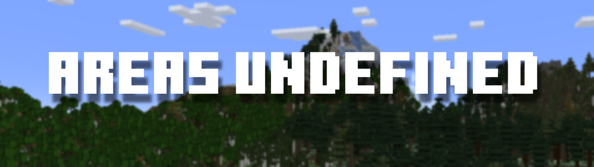

# Regions Unexplored Add-on List

This is a simple repo to list and provide users direction to add-ons to use with Regions Unexplored. 

## The Add-on List

### Area's Undefined



- compatible: 0.4.x
- incompatible: 0.5.x+

<a href="https://www.curseforge.com/minecraft/mc-mods/areas-undefined" ></a>


## Contribution

If you have an add-on, and you want it on the list, you can make a PR and follow the build order
```markdown
## Add-on Name

.png"> # optional is not required, but make sure to add a picture for this to work :3 

- compatible: <version compatible>
- incompatible: <version incompatible>

you can add these banners to your addon
<a href="<link to cf page>" ></a>
<a href="<link to mr page>"></a>
```